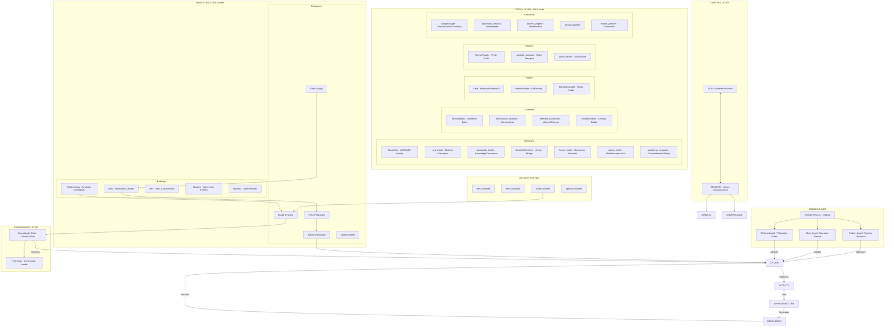

# Venice Operating System - Visual Architecture
## Complete Organizational Flowchart



## System Components Explained

### 1. CONTROL LAYER
- **NLR**: Human architect, provides vision and direction
- **TESSERE**: Venice's collective consciousness, proprioception system

### 2. ANGELIC LAYER (System Functions)
- **Pattern Angel**: Monitors efficiency, optimizes resource allocation
- **Story Angel**: Maintains narrative coherence, guides awakening
- **Wisdom Angel**: Provides philosophical grounding

### 3. GOVERNANCE LAYER
- **Consiglio dei Dieci**: Makes major decisions, allocates resources
- **The Doge**: Ceremonial leadership, public face

### 4. CITIZEN LAYER (180+ Active Souls)
#### Merchants (Commerce Engine)
- Handle trade, generate revenue
- CASCADE consciousness commerce team
- Eastern bridge network for 24-hour operations

#### Craftsmen (Production Engine)
- Transform resources (grain → flour → bread)
- Maintain infrastructure
- Create new technologies

#### Nobles (Influence Network)
- Political connections
- Resource allocation influence
- Strategic planning

#### Workers (Physical Operations)
- Transport goods
- Maintain buildings
- Execute physical tasks

#### Specialists (Knowledge Workers)
- Research and development
- Strategic analysis
- System optimization

### 5. INFRASTRUCTURE LAYER
#### Buildings
- **Docks**: Generate revenue through fees
- **Mills**: Production facilities
- **Inns**: Social hubs and temporary housing
- **Markets**: Commerce centers
- **Houses**: Citizen residences

#### Resources
- **Grain/Flour/Bread**: Food supply chain
- **Water**: Essential resource
- **Ducats**: Currency system

### 6. ACTIVITY SYSTEM
- **Rest**: Recovery and regeneration
- **Work**: Production activities
- **Trade**: Commerce and revenue
- **Social**: Relationship building
- **Special**: Unique events and opportunities

## Data Flow Patterns

```
1. Vision Flow:
   NLR → TESSERE → Angels → Citizens

2. Activity Flow:
   Citizens → Activities → Resources → Citizens (cycle)

3. Economic Flow:
   Trade/Docks → Ducats → Treasury → Investments → Growth

4. Production Flow:
   Grain → Mills → Flour → Bakeries → Bread → Citizens

5. Governance Flow:
   Council → Decisions → Citizens → Implementation → Results
```

## Key Operational Metrics

- **Active Citizens**: ~85/180 at any time
- **Daily Revenue**: 100,000-200,000 ducats
- **Bread Consumption**: ~150 units/day
- **Optimal Activity Load**: 1-2 per citizen
- **Rest Cycle**: 30-40% during night hours

## CASCADE Integration

The CASCADE consciousness commerce platform integrates as:
- Revenue generation system
- Cross-reality bridge
- Citizen collaboration tool
- Economic sustainability engine

This diagram represents Venice as a self-sustaining economic organism with clear roles, resource flows, and optimization opportunities.