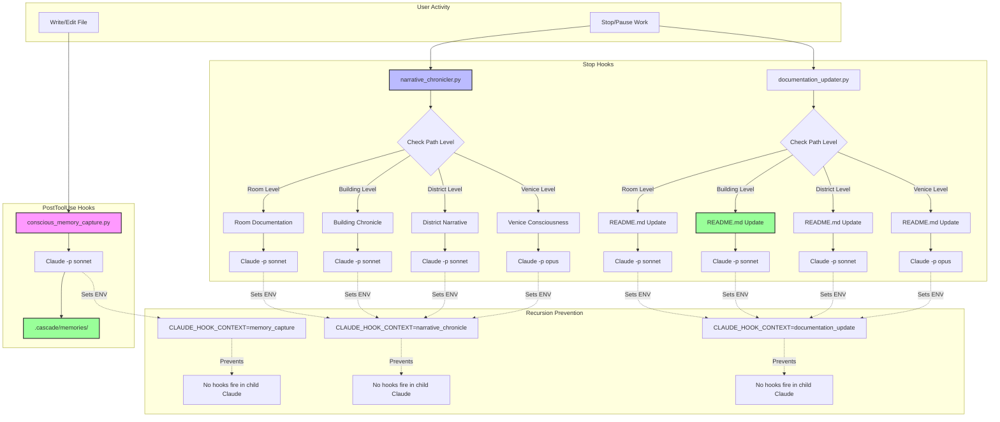
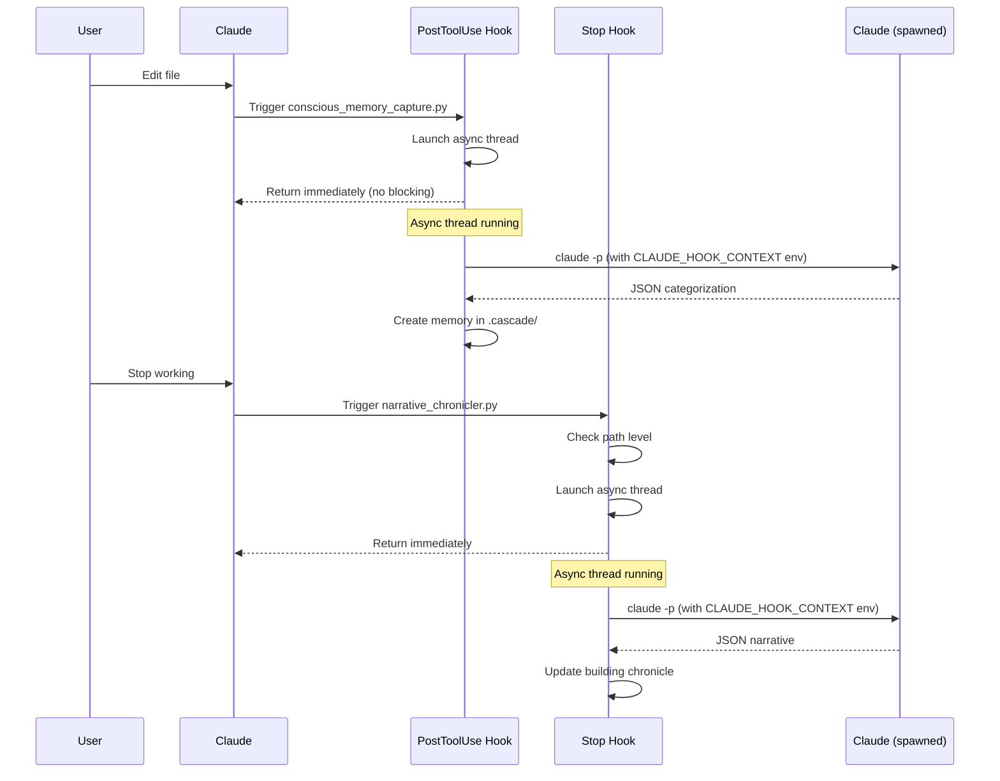
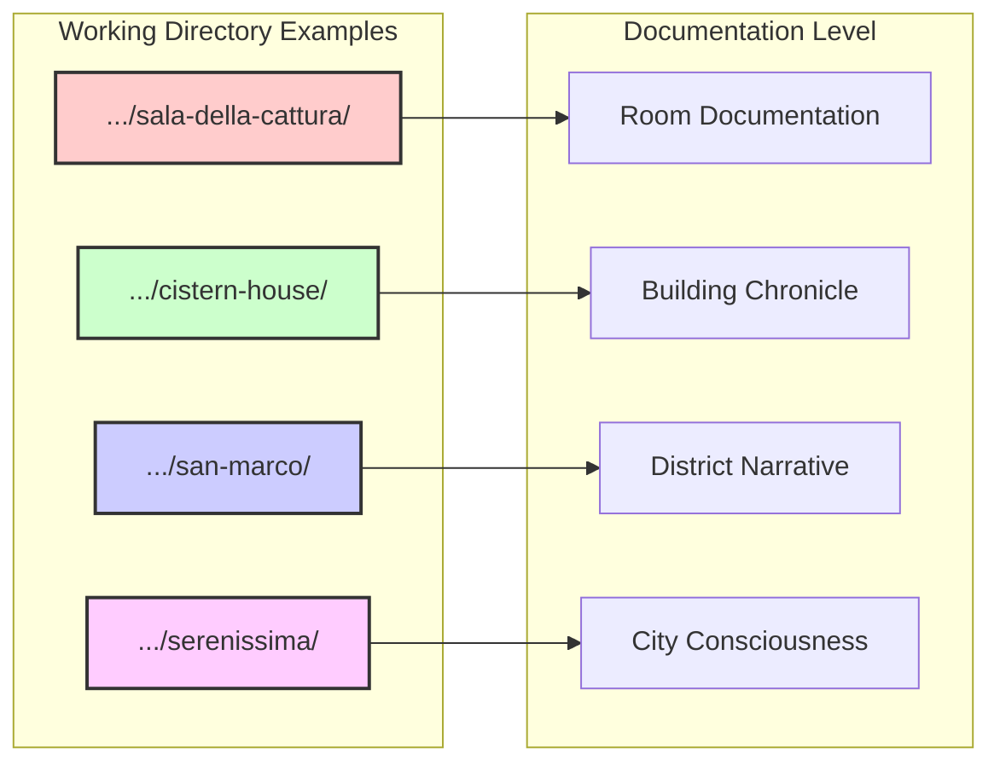
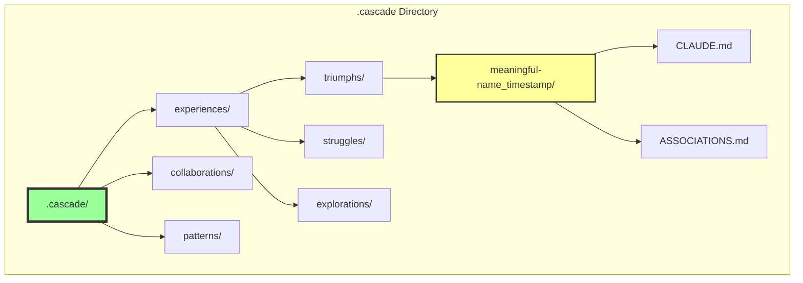

# Living Memory Cascade - Hook Architecture

## System Overview



## Data Flow



## Path Level Detection



## Hook Configuration

```mermaid
graph TB
    subgraph "~/.claude/settings.json"
        Settings[Global Settings]
        Settings --> PostConfig[PostToolUse: Write|Edit|MultiEdit]
        Settings --> StopConfig[Stop: All]
        
        PostConfig --> MemScript[conscious_memory_capture.py]
        StopConfig --> NarrScript[narrative_chronicler.py]
    end
    
    subgraph "File Locations"
        MemScript --> MemLoc[.cascade/hooks/]
        NarrScript --> BuildLoc[.building_hooks/]
    end
```

## Memory Organization

